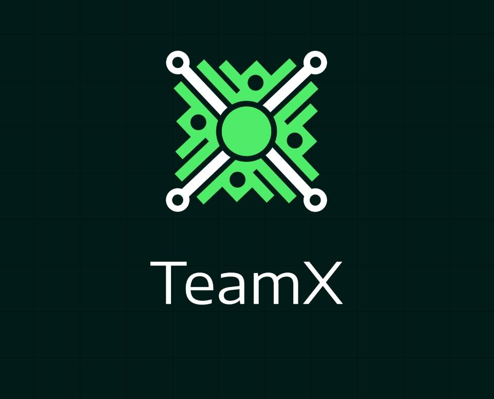

# TeamX

TeamX's goal is to provide a quick and easy way to find collaborators for any type of project. TeamX offers a platform on which to publish and search for advertisements, giving the user the possibility to define certain parameters such as location, level of difficulty and area of expertise.

TeamX was designed and built as a virtual meeting place and therefore does not have its own communication system: the app interfaces with the most popular means of communication to offer users a fluid experience of the transition from research to foundation of a team.

The app was developed for Android and iOS using Xamarin. The database was created on an Azure server, directly implementing all its services through SQL.

The app allows users to:

* Register using a valid email, to which a self-generated password is automatically sent;
* Create announcements to engage people in your team, by entering a brief description and, optionally, information relating to the fields listed above (location, difficulty, area of expertise, expiration date);
* Modify or delete created announcements;
* Send a maximum of 3 requests for participation to each team, possibly accompanied by short introductory messages;
* Accept or decline requests to participate in their teams;
* Browse team announcements to participate in relating to a specific area of expertise, difficulty and / or location;
* Personalize your profile with short descriptions for each area of expertise, by inserting references to your social profiles (Facebook, Twitter, LinkedIn), or change your login credentials to the app.
* See a list of the teams you have joined, or are still participating in on your profile.

TeamX is therefore aimed at anyone who needs to create a team, whether it is development for a software, for a game of Apex Legends or for a game of soccer.

Project done for the bachelor degree (February 2019) for the Mobile computing class.

## Authors

Giulia Lanzillotta  

Paolo Mandica 

Luigi Sigillo 

